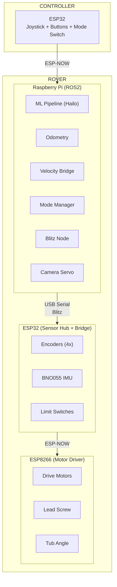

# Caterpillar Rover - System Overview

> **Robocon 2026 Sand Collection Robot**  
> ROS2 + ESP32 + ESP-NOW Architecture

---

## Robot Features

| Component | Description |
|-----------|-------------|
| **Drive** | Tank/differential (4 motors) |
| **Lead Screw** | Vertical scoop control |
| **Tub Motor** | Sand tub rotation |
| **Scoop** | Front bulldozer blade |
| **Camera Servo** | Crater detection tilt |

---

## System Architecture

---

## ROS2 Nodes

| Node | Purpose |
|------|---------|
| `blitz_node` | Serial bridge (RPi5 optimized) |
| `odom_node` | Wheel odometry + TF (10Hz) |
| `velocity_bridge` | Nav2 → MCU with crater avoidance |
| `mode_manager` | Manual/Auto switching |
| `ml_bridge` | ML detection to ROS |
| `camera_servo_node` | Crater-tracking servo |
| `auto_mission` | Autonomous excavation loop |

---

## Key Topics

| Topic | Type | Flow |
|-------|------|------|
| `/velocity` | Velocity | ROS → MCU |
| `/encoder_raw` | EncoderRaw | MCU → ROS |
| `/bno` | BnoReading | MCU → ROS |
| `/mode_switch` | ModeSwitch | MCU → ROS |
| `/ml_pipeline` | String | ML → ROS |
| `/servo_cmd` | ServoCmd | ROS → MCU |
| `/odom` | Odometry | Internal |
| `/cmd_vel` | Twist | Nav2 → Bridge |

---

## Wiring

| Connection | GPIO |
|------------|------|
| Mode Switch | ESP32 GPIO27 |
| Encoders | GPIO32-35 |
| BNO055 (I2C) | GPIO21/22 |
| Camera Servo | GPIO17 |
