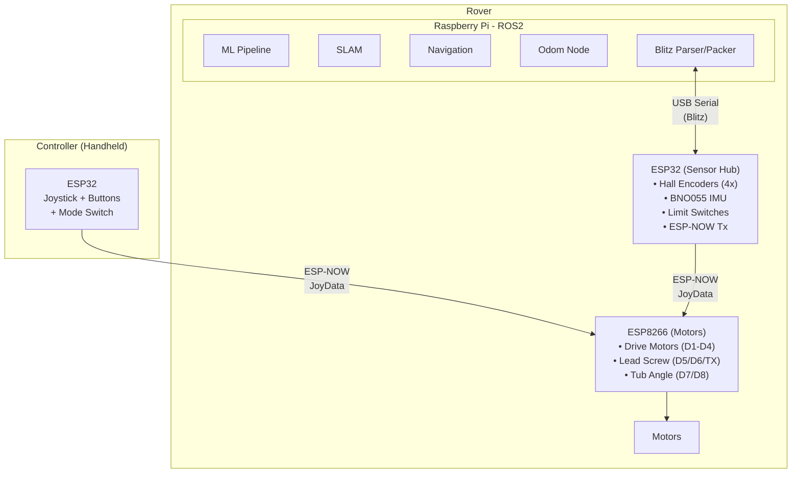
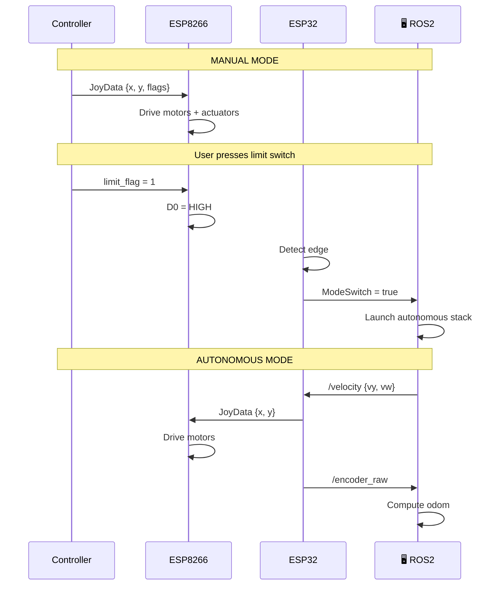

# Caterpillar Robot - Implementation Plan

> **Hybrid Manual/Autonomous Bulldozer Control System**  
> ROS2 + ESP32 + ESP-NOW Architecture

---

## Robot Overview

The Caterpillar is a **sand-collecting bulldozer** robot for Robocon 2026. It features:

| Component | Description |
|-----------|-------------|
| **Drive System** | Tank/differential drive (4 motors, 2 per side) |
| **Lead Screw Motor** | Controls the vertical position of the scoop |
| **Tub Angle Motor** | Rotates the sand tub via rope mechanism |
| **Scoop** | Front-mounted bulldozer blade for sand collection |

```
        ┌─────────────────────────────┐
        │      SAND TUB (rotates)     │
        │    ╱                   ╲    │
        │   ╱  Rope Motor (left)  ╲   │
        ├───────────────────────────────┤
        │                               │
        │   ┌───┐             ┌───┐    │  ← Lead Screw (right_flag)
        │   │ L │             │ R │    │     controls scoop height
        │   │   │             │   │    │
        │   │ M │   ESP32     │ M │    │  ← Rover ESP32 (Blitz bridge)
        │   │ O │             │ O │    │
        │   │ T │   ESP8266   │ T │    │  ← Motor Controller
        │   │ O │             │ O │    │
        │   │ R │             │ R │    │
        │   └───┘             └───┘    │
        │  ═══════════════════════════ │  ← Scoop (bulldozer blade)
        └───────────────────────────────┘
              ▓▓▓▓▓▓▓     ▓▓▓▓▓▓▓
              Tracks      Tracks
```

---

## System Architecture



---

## Motor Control Mapping

### Drive Motors (Differential)
| JoyData | ESP8266 Pins | Function |
|---------|--------------|----------|
| `y + x` | D1, D2 | Left side (forward/reverse) |
| `y - x` | D3, D4 | Right side (forward/reverse) |

### Auxiliary Motors
| Flag | Pins | Motor | States |
|------|------|-------|--------|
| `right_flag` | D5, D6, TX | **Lead Screw** | 0=Stop, 1=Up, 2=Down |
| `left_flag` | D7, D8 | **Tub Angle** | 0=Stop, 1=CW, 2=CCW |
| `limit_flag` | D0 | Mode switch signal | 0=Manual, 1=Auto |

---

## Mode Switching



---

## ROS2 Topics

### Nav2 Compatible
| Topic | Message | Direction | Purpose |
|-------|---------|-----------|---------|
| `/odom` | `nav_msgs/Odometry` | Internal | Standard odometry with TF |
| `/cmd_vel` | `geometry_msgs/Twist` | Nav2→ROS | Velocity commands from Nav2 |

### Blitz/MCU Communication
| Topic | Message | Direction | Purpose |
|-------|---------|-----------|---------|
| `/velocity` | `Velocity` | ROS→MCU | Drive commands (vy, vw) |
| `/encoder_raw` | `EncoderRaw` | MCU→ROS | Wheel encoder ticks |
| `/bno` | `BnoReading` | MCU→ROS | IMU orientation (yaw, pitch, roll) |
| `/mode_switch` | `ModeSwitch` | MCU→ROS | Manual/Auto toggle |
| `/rover_limit_sw` | `LimitSwitches` | MCU→ROS | Action feedback |

### TF Frames
| Parent | Child | Published By |
|--------|-------|--------------|
| `odom` | `base_link` | `odom_node` |

### Data Flow
```
Nav2 /cmd_vel (Twist) → velocity_bridge → /velocity (custom) → Blitz → MCU
MCU → Blitz → /encoder_raw, /bno → odom_node → /odom (nav_msgs/Odometry)
```

---

## Implementation Status

| Phase | Description |
|-------|-------------|
| 1 | Manual mode verification |
| 2 | ROS2 interfaces (messages, Blitz configs) |
| 3 | ESP32 rover bridge code |
| 4 | Odometry node |
| 5 | Mode manager + launch files |
| 6 | Autonomous stack (ML, SLAM, Nav) |

---

## Current Limitations

> **Auxiliary motors not yet controlled via ROS2**
> 
> The `right_flag` (lead screw) and `left_flag` (tub angle) are currently only 
> controllable in **manual mode** via the handheld joystick buttons.
> 
> For Phase 6, consider adding:
> - `/lead_screw` topic (Int8: 0/1/2)
> - `/tub_angle` topic (Int8: 0/1/2)

---

## Hardware Wiring

| Connection | Purpose |
|------------|---------|
| ESP8266 D0 → ESP32 GPIO27 | Mode switch detection |
| Encoder FL → ESP32 GPIO34 | Front-left wheel ticks |
| Encoder FR → ESP32 GPIO35 | Front-right wheel ticks |
| Encoder BL → ESP32 GPIO32 | Back-left wheel ticks |
| Encoder BR → ESP32 GPIO33 | Back-right wheel ticks |
| BNO055 SDA → ESP32 GPIO21 | IMU I2C data |
| BNO055 SCL → ESP32 GPIO22 | IMU I2C clock |

> [!NOTE]
> Update pin numbers in `caterpillar_pins.h` to match actual wiring.

---

## Quick Start

```bash
# Launch (run once before competition)
ros2 launch rover manual.launch.py

# Test mode switching (without hardware)
ros2 topic pub /mode_switch robot_interfaces/msg/ModeSwitch "{autonomous: true}" --once
```

---